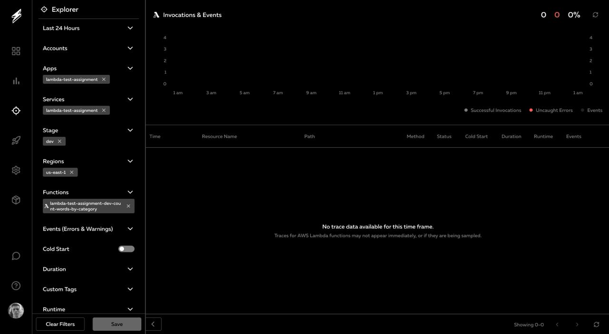
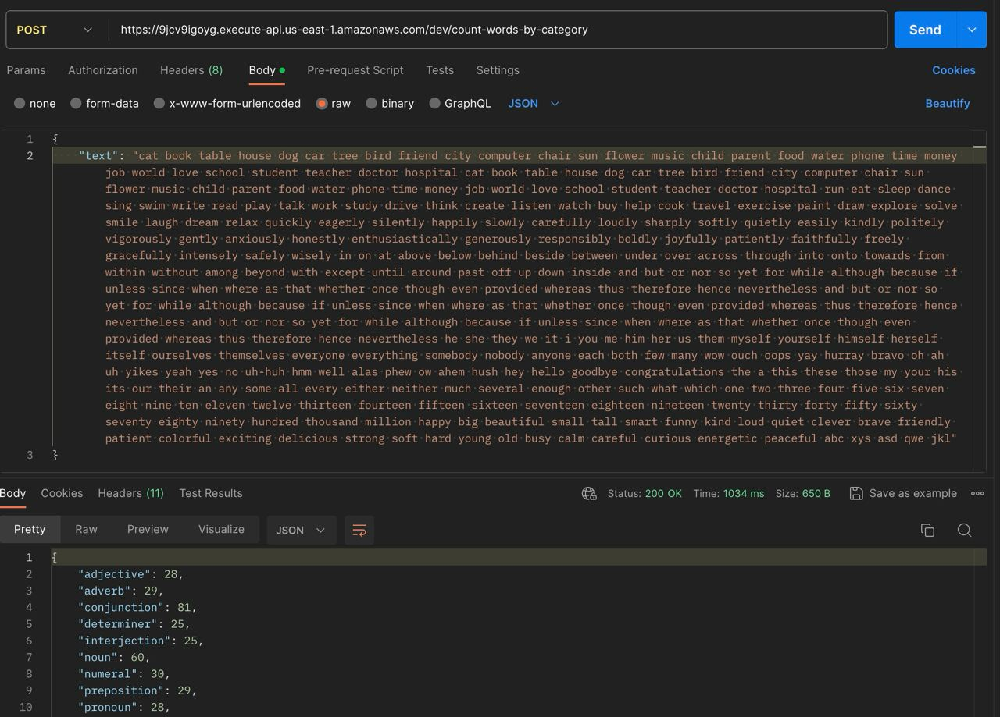

# Test assignment

### My thoughts (PLEASE READ)

It may seem that there is too much code in this project, since you've asked just for a single lambda function. But my
idea was to treat this test assignment as real commercial project to demonstrate what decisions I make whenever I have
to deal with project which will probably become bigger and more complicated over time. Also with only one function there
would be too little space for me to demonstrate my ability to utilize TypeScript.

I've extracted main functionality
into ["use case"](./src/use-cases/text-processing/count-words-by-category.use-case.ts) to make it possible in future to
make it an "injectable" and use nice dependency management provided by IOC container of *infersify*, *NestJS*, or
anything else. Also, it is really easy to write tests when application has separated, well-defined layers (
*Controller -> Use case -> Service -> Repository*). I've covered this use case
with [simple test cases](./src/use-cases/text-processing/count-words-by-category.spec.ts).

By the way, I've detected a conflict in the requirements (at least I treat it as such). Some words from dictionary
consist of two words separated with space. Since the delimiter of input is also a space there will be no entries
consisting of multiple words because everything is split by space character. Example: pronoun "no one" consists of "no"
(interjection) and "one" (numeral), thus algorithm will increment fields *interjection* but *numeral* and *pronoun* will
remain unchanged.

---

### Usage

#### Prerequisites

- Recommended Node.js version is >=18. Earlier versions may cause problems
- [*Serverless*](https://www.serverless.com/) installed and (if needed) configured

#### Backend

```shell
npm install

npm run prepare

npm run dev
```

#### Frontend

```shell
cd frontend

touch .env && echo "VITE_API_URL=http://localhost:3000/dev" > .env 

npm install

npm run dev
```

---

### Deployment

```shell
# Launches linter, tests then builds (using `webpack`) and deploys lambdas (via `serverless`)
npm run deploy
```

---

### Proofs that project can be deployed and works

***Serverless dashboard with deployed lambda:***



***Response from deployed lambda:***


